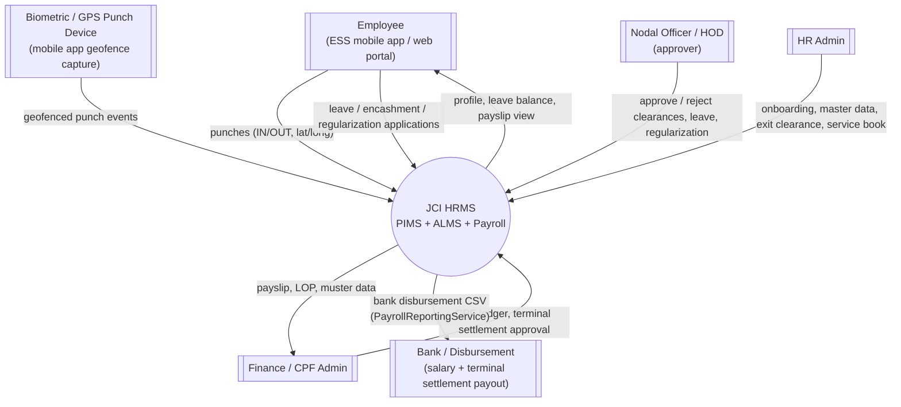
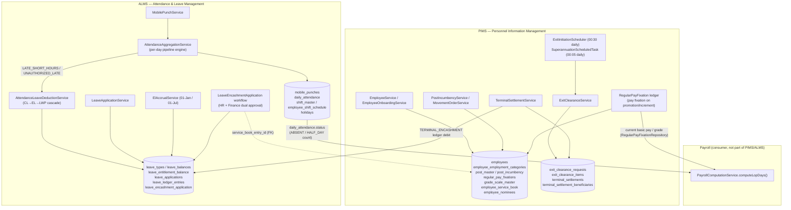
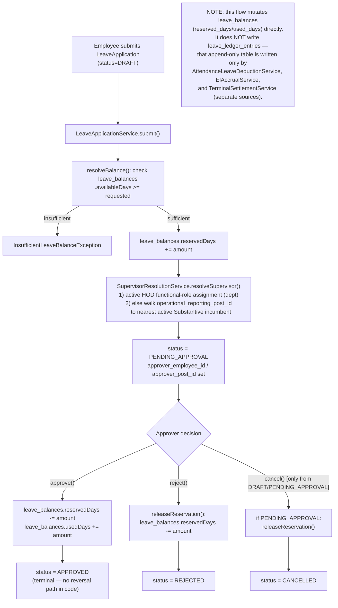
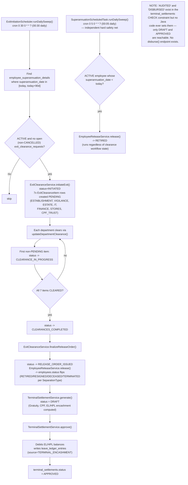
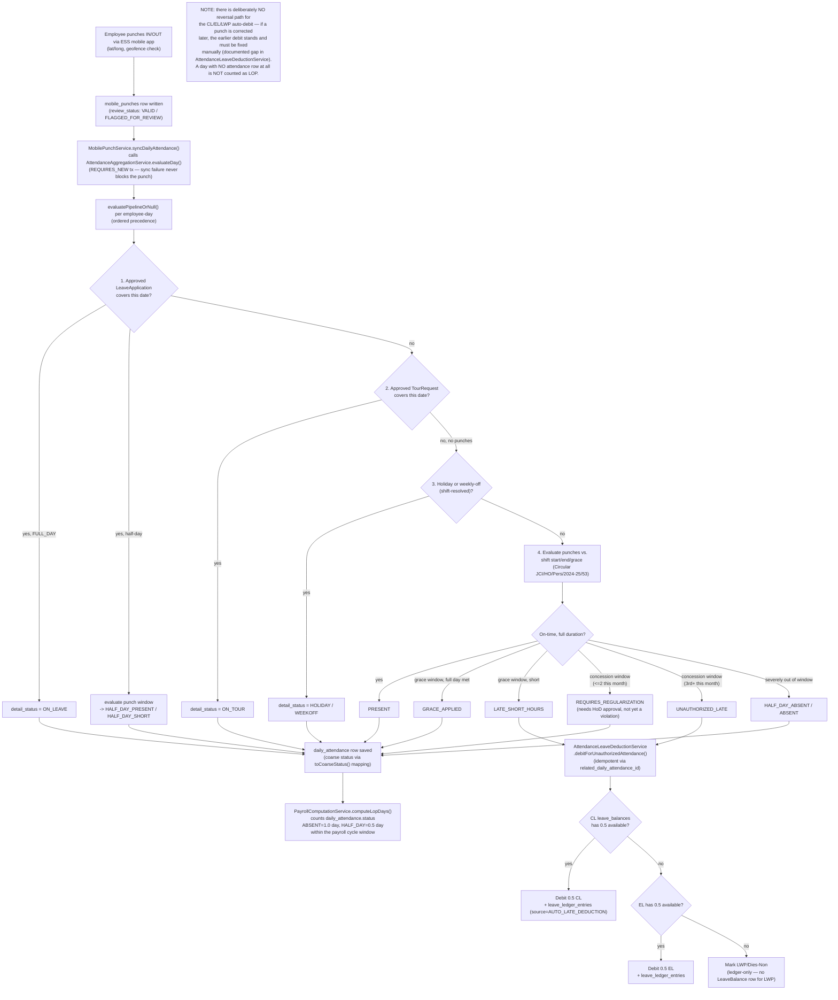

# Data Flow Diagrams — PIMS & ALMS

Grounded in the actual backend (`backend/src/main/java/in/gov/jci/hrms`) and migrations
(`backend/src/main/resources/db/migration`) as of migration V60. Where the source naming
differs from common ALMS terminology, the real name is used and the assumed name is noted.

> **Naming corrections vs. common assumptions**
> - There is no `attendance_punches` table — the real table is `mobile_punches` (V7), written by
>   `MobilePunchService` from the ESS mobile app's geofenced IN/OUT punches.
> - There is no `alms_attendance_summaries` table — `daily_attendance` (V7, extended V14/V36) is
>   the one-row-per-employee-per-day summary; V36's own header comment explicitly rejects adding
>   a duplicate table.
> - "Roster shifts" = `shift_master` (V43) + `employee_shift_schedule` (V44), not a single
>   `roster_shifts` table.
> - "Holidays master" = `holidays` (V14), not `holidays_master`.

---

## Level 0 — System Context Diagram

**Verified touchpoint**: `PayrollReportingService` generates a bank disbursement CSV that
excludes on-hold (`is_hold`) payslips — confirming the Bank Remittance external entity is real,
not assumed. There is no confirmed inbound feed *from* a bank (no reconciliation/NEFT-return
ingestion found) — the Bank arrow is one-way (HRMS → Bank) as implemented today.

---

## Level 1 — Module Decomposition

**Interface points confirmed in code**:
- ALMS → Payroll: `PayrollComputationService.computeLopDays()` reads `daily_attendance.status`
  (coarse `AttendanceStatus`) directly — counts `ABSENT` as 1.0 day, `HALF_DAY` as 0.5. This is
  the *only* verified ALMS→Payroll bridge; `attendance_payroll_cutoff` (freeze window table) has
  no writer anywhere in the codebase and is dead schema.
- PIMS → Payroll: `PayrollComputationService.resolveCurrentGradeScale()` reads
  `regular_pay_fixations` (via `RegularPayFixationRepository.findByEmployeeIdAndCurrentTrue`).
- PIMS → ALMS: `TerminalSettlementService.approve()` writes a `TERMINAL_ENCASHMENT`
  `leave_ledger_entries` row when it encashes EL/HPL at separation — the one confirmed write from
  a PIMS service into an ALMS ledger table.

---

## Level 2.1 — Leave Application: Submission → Approval → Ledger Debit/Reversal

Traced from `LeaveApplicationService` (`submit`/`approve`/`reject`/`cancel`) and
`SupervisorResolutionService`.

**Correction vs. common assumption**: approval is **single-level**, not multi-tier. There is no
"recommend" intermediate role/state — one resolved approver (HOD functional-role assignment, or a
post-hierarchy walk to the nearest post with an active Substantive incumbent) approves directly.
There is also **no reversal after `APPROVED`** — `leave_balances.usedDays` is never decremented
back once approved; only `PENDING_APPROVAL`→`REJECTED`/`CANCELLED` releases the reservation.

---

## Level 2.2 — Daily Superannuation Transition → Exit Clearance → Terminal Settlement Sanction

Traced from `SuperannuationScheduledTask`, `ExitInitiationScheduler`, `ExitClearanceService`,
`EmployeeReleaseService`, `TerminalSettlementService`.

---

## Level 2.3 — Attendance Punch Ingestion → Monthly Evaluation → LOP Computation

Traced from `MobilePunchService`, `AttendanceAggregationService.evaluatePipelineOrNull()`
(the per-day pipeline), `AttendanceLeaveDeductionService`, and
`PayrollComputationService.computeLopDays()`.

