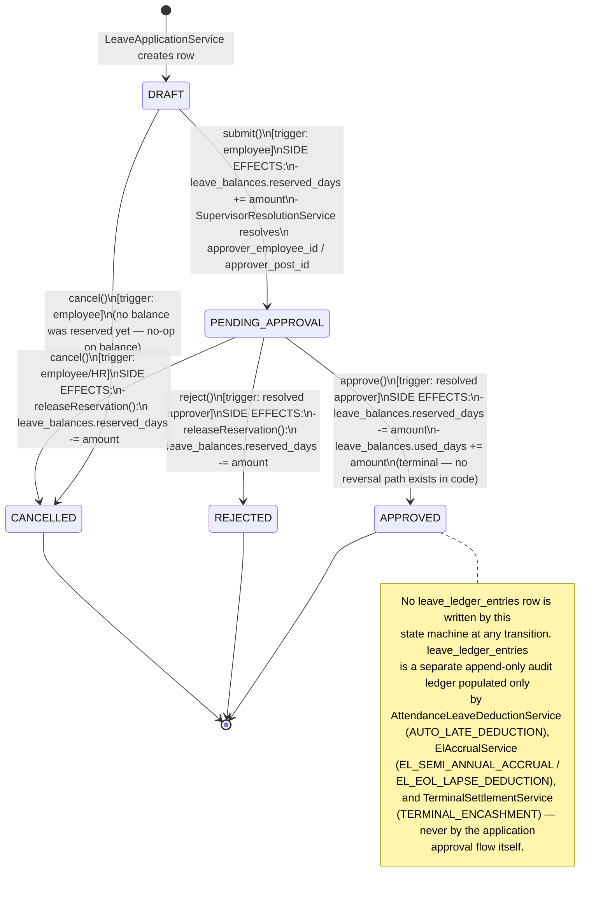

# Enhanced / Event-Driven Data Flow Diagram — PIMS & ALMS

State machines below use the **exact enum/CHECK-constraint values found in code** — several
differ from commonly assumed names (noted inline). Traced from `LeaveApplicationService`,
`ExitClearanceService`, `EmployeeReleaseService`, `TerminalSettlementService`,
`SuperannuationScheduledTask`, `ExitInitiationScheduler`, and `ElAccrualService`.

---

## Leave Application State Machine

**Correction vs. common assumption**: the real states are `DRAFT → PENDING_APPROVAL → APPROVED |
REJECTED | CANCELLED` (`ck_leave_applications_status`, V7 + `LeaveApplicationStatus` enum) — there
is **no `SUBMITTED` or `RECOMMENDED` state**. Approval is single-level (one resolved approver via
`SupervisorResolutionService`), not a multi-tier chain.

---

## Separation / Exit State Machine

Two linked entities, each with its own status column — `exit_clearance_requests.status`
(`ExitClearanceStatus`) and `terminal_settlements.status` (`TerminalSettlementStatus`). The user's
assumed single chain ending in `SETTLED` does not exist as one state machine in code; settlement
is a **separate downstream entity** triggered after `RELEASE_ORDER_ISSUED`.

```mermaid
stateDiagram-v2
    [*] --> INITIATED : initiateExit()\n[trigger: ExitInitiationScheduler T-90 auto-draft,\nOR manual HR-initiated call]\nSIDE EFFECTS:\n- 7x exit_clearance_items rows created,\n  one per ExitClearanceDepartment, all PENDING\n  (ESTABLISHMENT, VIGILANCE, ESTATE, IT,\n   FINANCE, STORES, CPF_TRUST)

    INITIATED --> CLEARANCE_IN_PROGRESS : updateDepartmentClearance()\n[trigger: any department officer]\non the FIRST item to leave PENDING
    INITIATED --> CANCELLED : (status allows CANCELLED;\nno dedicated cancel() method found —\nlikely direct status update, unverified)

    CLEARANCE_IN_PROGRESS --> CLEARANCE_IN_PROGRESS : updateDepartmentClearance()\n[trigger: each remaining department]\nSIDE EFFECTS per item:\n- exit_clearance_items.status -> CLEARED\n  or REJECTED_WITH_DUES\n- dues_recovery_amount recorded
    CLEARANCE_IN_PROGRESS --> CANCELLED

    CLEARANCE_IN_PROGRESS --> CLEARANCES_COMPLETED : updateDepartmentClearance()\nwhen clearedCount == totalCount (all 7 CLEARED)

    CLEARANCES_COMPLETED --> RELEASE_ORDER_ISSUED : finalizeReleaseOrder()\n[trigger: HR Admin]\nSIDE EFFECTS:\n- release_order_ref_no / release_order_date set\n- EmployeeReleaseService.release() ->\n  employees.status flips to RETIRED/RESIGNED/\n  DECEASED/TERMINATED per SeparationType\n  (VRS also maps to RETIRED)

    RELEASE_ORDER_ISSUED --> [*]
    CANCELLED --> [*]

    state "terminal_settlements (separate entity)" as TS {
        [*] --> DRAFT : generate()\n[trigger: HR/Finance, after RELEASE_ORDER_ISSUED]\nComputes gratuity, CPF payout, EL/HPL encashment
        DRAFT --> APPROVED : approve()\n[trigger: Finance/CPF Admin]\nSIDE EFFECTS:\n- debits el_balance/hpl_balance\n- writes leave_ledger_entries\n  (source = TERMINAL_ENCASHMENT)
        APPROVED --> [*]
    }

    RELEASE_ORDER_ISSUED --> TS : hands off to

    note right of TS
        AUDITED and DISBURSED exist in the DB
        CHECK constraint but are never set by any
        Java code — no disburse() endpoint exists.
        DRAFT and APPROVED are the only reachable
        states today.
    end note

    note right of INITIATED
        SuperannuationScheduledTask runs an INDEPENDENT
        daily 00:05 sweep that force-flips employees.status
        ACTIVE -> RETIRED once superannuation_date has
        passed, REGARDLESS of this state machine's current
        state — a hard safety net, not a transition of
        exit_clearance_requests itself.
    end note
```

---

## Scheduler Events

Every `@Scheduled` job in the codebase touching PIMS/ALMS (confirmed via
`backend/src/main/java/in/gov/jci/hrms/config/SchedulingConfig.java` and each service's own
annotation — there are exactly three; this is the complete list, not a subset):

| Job | Cron | Cadence (verified) | What it does |
|---|---|---|---|
| `ElAccrualService.runSemiAnnualAccrual()` | `0 0 0 1 1,7 *` | **Semi-annual** — midnight on 01-Jan and 01-Jul (confirmed bi-annual, matches assumption) | Credits **15.00 days EL** per half-year to every REGULAR-cadre employee (`leave_entitlement_balance`, source `EL_SEMI_ANNUAL_ACCRUAL`). Also applies an approximate "EOL 1/10th" deduction: since this schema has no dedicated Extraordinary Leave figure, it deducts 1/10th of the prior half-year's LWP ledger debits as a proxy (source `EL_EOL_LAPSE_DEDUCTION`) — explicitly documented in code as an approximation, not an exact CCS(Leave) Rules implementation. |
| `ExitInitiationScheduler.runDailySweep()` | `0 30 0 * * ?` | Daily, 00:30 | Finds every still-`ACTIVE` employee whose `employee_superannuation_details.superannuation_date` falls within the next **90 days** (confirmed T-90, matches assumption) and has no open (non-`CANCELLED`) `exit_clearance_requests` row yet, then auto-drafts one via `ExitClearanceService.initiateExit()` (status `INITIATED`, all 7 department items `PENDING`). |
| `SuperannuationScheduledTask.runDailySweep()` | `0 5 0 * * ?` | Daily, 00:05 (near-midnight, not exactly midnight) | Hard safety net: any still-`ACTIVE` employee whose `superannuation_date` has **already passed** is force-transitioned to `RETIRED` via `EmployeeReleaseService`, independent of whether the Exit Formalities clearance workflow ever ran. Ensures no REGULAR employee can keep drawing an increment or active salary past their statutory date purely because HR never ran the exit workflow. |

No other `@Scheduled` jobs exist for attendance regularization, leave lapse/carry-forward at
calendar year-end, or payroll cutoff freezing — `attendance_payroll_cutoff` (the freeze-window
table) has no scheduled or manual writer anywhere in the codebase (dead schema, confirmed by the
entity's own javadoc).
