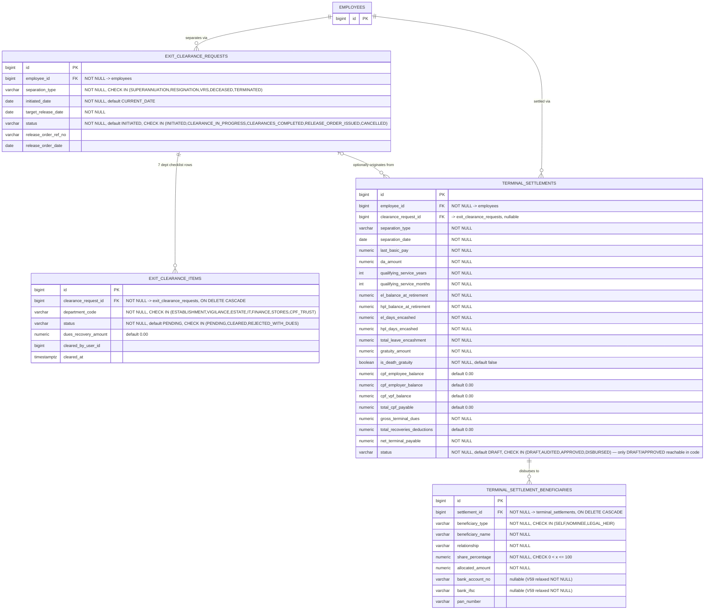

# Entity-Relationship Diagram — PIMS & ALMS

Reflects the schema **as of migration V60** (`decouple_pay_scale_master_fk_drift`), cross-checked
against both the `CREATE TABLE`/`ALTER TABLE` statements in
`backend/src/main/resources/db/migration/` and the current JPA entity classes.

**Post-V60 state, explicitly**: `employee_employment_categories.pay_scale_id` and
`employees.pay_scale_id` were dropped outright (the FK on the former had drifted to point at
`grade_scale_master` instead of the legacy `pay_scale_master`, and the latter was always empty).
`employee_service_book.pay_scale_id` was repointed and renamed to `grade_scale_id`, backfilled
from `pay_scale_master.grade` → `grade_scale_master.scale_code`. `pay_scale_master` itself still
exists (read-only, `@Deprecated` service/controller) but is **not** part of the current live
compensation path — `employee_employment_categories.scale_code` (FK to
`grade_scale_master.scale_code`) and `regular_pay_fixations` are the two live links.

---

## PIMS Core

```mermaid
erDiagram
    EMPLOYEES {
        bigint id PK
        varchar employee_code UK
        varchar cpf_ac_no "NOT NULL"
        varchar hrms_user_id
        varchar salutation "NOT NULL, enum"
        varchar first_name "NOT NULL"
        varchar last_name "NOT NULL"
        varchar pan_number "NOT NULL"
        varchar personal_email "NOT NULL"
        varchar phone "NOT NULL"
        date date_of_birth "NOT NULL"
        date date_of_joining "NOT NULL"
        bigint department_id FK "NOT NULL -> departments"
        bigint designation_id FK "NOT NULL -> designations"
        bigint ro_id FK "-> regional_offices, nullable"
        bigint dpc_id FK "-> departmental_purchase_centres, nullable"
        varchar status "NOT NULL, enum EmployeeStatus"
        boolean is_nps_eligible "NOT NULL"
        boolean is_eps_eligible "NOT NULL"
        timestamptz deleted_at "soft delete"
    }

    DEPARTMENTS {
        bigint id PK
        varchar code UK
        varchar name
    }

    DESIGNATIONS {
        bigint id PK
        varchar title
        varchar category_type
    }

    EMPLOYEE_EMPLOYMENT_CATEGORIES {
        bigint id PK
        bigint employee_id FK "NOT NULL -> employees"
        varchar employment_category "NOT NULL, enum REGULAR/CONTRACTUAL/OUTSOURCED/CASUAL"
        varchar scale_code FK "-> grade_scale_master.scale_code (sole grade link since V60)"
        numeric regular_basic_pay "kept in sync by MovementOrderService"
        numeric daily_wage_rate "CASUAL only"
        bigint vendor_id FK "-> vendor_master, OUTSOURCED only"
        numeric monthly_ctc "OUTSOURCED only"
        boolean is_active "NOT NULL"
        timestamptz deleted_at
    }

    GRADE_SCALE_MASTER {
        bigint id PK
        varchar scale_code UK "NOT NULL — FK target for scale_code columns elsewhere, not the PK"
        varchar cadre "NOT NULL, enum BOARD/EXECUTIVE/STAFF"
        int hierarchy_level "NOT NULL, UNIQUE"
        boolean is_board_level "NOT NULL"
        numeric minimum_basic "NOT NULL"
        numeric maximum_basic "NOT NULL, CHECK >= minimum_basic"
        numeric increment_rate "NOT NULL"
        varchar scale_type "NOT NULL, enum IDA/CDA"
        date effective_date "NOT NULL"
        boolean is_active "NOT NULL"
    }

    REGULAR_PAY_FIXATIONS {
        bigint id PK
        bigint employee_id FK "NOT NULL -> employees, ON DELETE CASCADE"
        varchar scale_code FK "NOT NULL -> grade_scale_master.scale_code"
        numeric basic_pay "NOT NULL"
        date effective_from "NOT NULL"
        date effective_to
        varchar increment_cycle "NOT NULL, enum JULY/JANUARY"
        varchar fixation_reason "NOT NULL, enum INITIAL_APPOINTMENT/PROMOTION/ANNUAL_INCREMENT/CORRECTION"
        varchar order_ref_no
        boolean is_current "NOT NULL, PARTIAL UNIQUE INDEX per employee_id WHERE true"
    }

    POST_MASTER {
        bigint id PK
        varchar post_code
        varchar title "NOT NULL"
        bigint department_id FK "NOT NULL"
        bigint designation_id FK "NOT NULL"
        bigint ro_id FK
        bigint dpc_id FK
        bigint operational_reporting_post_id FK "self-FK -> post_master"
        bigint administrative_reporting_post_id FK "self-FK -> post_master"
        bigint accepting_authority_post_id FK "self-FK -> post_master"
        varchar vacancy_status "NOT NULL, enum"
        boolean is_budgeted "NOT NULL"
        boolean is_active "NOT NULL"
        timestamptz deleted_at
    }

    POST_INCUMBENCY {
        bigint id PK
        bigint post_id FK "NOT NULL -> post_master"
        bigint employee_id FK "NOT NULL -> employees"
        varchar assignment_type "NOT NULL, enum SUBSTANTIVE/ADDITIONAL_CHARGE"
        date start_date "NOT NULL"
        date end_date
        varchar order_reference
        boolean is_active "NOT NULL"
        timestamptz deleted_at
    }

    EMPLOYEE_SERVICE_BOOK {
        bigint id PK
        bigint employee_id FK "NOT NULL -> employees"
        date event_date "NOT NULL"
        varchar event_type "NOT NULL, free-text career-event code"
        varchar order_number
        date order_date
        bigint department_id FK "-> departments, nullable"
        bigint designation_id FK "-> designations, nullable"
        bigint regional_office_id FK "-> regional_offices, nullable"
        bigint grade_scale_id FK "-> grade_scale_master (V60: renamed from pay_scale_id)"
        numeric basic_pay
        boolean is_migrated "NOT NULL, legacy-import flag"
        timestamptz deleted_at
    }

    EMPLOYEE_NOMINEES {
        bigint id PK
        bigint employee_id FK "NOT NULL -> employees"
        varchar name "NOT NULL"
        varchar relationship "NOT NULL"
        numeric share_percentage "NOT NULL"
        varchar nominee_for "NOT NULL, e.g. CPF/GRATUITY/GIS"
        timestamptz deleted_at
    }

    EMPLOYEE_SUPERANNUATION_DETAILS {
        bigint id PK
        bigint employee_id FK "NOT NULL, UNIQUE -> employees (1:1)"
        date superannuation_date "NOT NULL"
        varchar retirement_type "NOT NULL"
        boolean is_board_director "NOT NULL"
        date director_appointment_date
        boolean is_ministry_extended "NOT NULL"
        date ministry_extended_upto
        varchar pension_settlement_status "NOT NULL"
        varchar gratuity_settlement_status "NOT NULL"
        numeric leave_encashment_days
    }

    DEPARTMENTS ||--o{ EMPLOYEES : "employs"
    DESIGNATIONS ||--o{ EMPLOYEES : "holds"
    EMPLOYEES ||--o{ EMPLOYEE_EMPLOYMENT_CATEGORIES : "has"
    GRADE_SCALE_MASTER ||--o{ EMPLOYEE_EMPLOYMENT_CATEGORIES : "scale_code"
    EMPLOYEES ||--o{ REGULAR_PAY_FIXATIONS : "has (1 current)"
    GRADE_SCALE_MASTER ||--o{ REGULAR_PAY_FIXATIONS : "scale_code"
    POST_MASTER ||--o{ POST_MASTER : "reports to (self-FK x3)"
    POST_MASTER ||--o{ POST_INCUMBENCY : "filled by"
    EMPLOYEES ||--o{ POST_INCUMBENCY : "occupies"
    EMPLOYEES ||--o{ EMPLOYEE_SERVICE_BOOK : "career ledger"
    GRADE_SCALE_MASTER ||--o{ EMPLOYEE_SERVICE_BOOK : "grade_scale_id"
    EMPLOYEES ||--o{ EMPLOYEE_NOMINEES : "nominates"
    EMPLOYEES ||--o| EMPLOYEE_SUPERANNUATION_DETAILS : "1:1"
```

---

## Separation & Settlement

---

## ALMS & Leave Management

```mermaid
erDiagram
    EMPLOYEES {
        bigint id PK
    }

    LEAVE_TYPES {
        bigint id PK
        varchar code "UK (per active row, partial unique WHERE deleted_at IS NULL)"
        varchar name "NOT NULL"
        numeric annual_quota "NOT NULL"
        int max_accumulation_days
        boolean is_encashable "NOT NULL, default false"
        int career_limit_days
        boolean is_active "NOT NULL, default true"
    }

    LEAVE_BALANCES {
        bigint id PK
        bigint employee_id FK "NOT NULL -> employees"
        bigint leave_type_id FK "NOT NULL -> leave_types"
        int year "NOT NULL"
        numeric credited_days "default 0"
        numeric used_days "default 0"
        numeric reserved_days "default 0"
    }
    LEAVE_BALANCES }o--|| LEAVE_TYPES : "UNIQUE(employee_id,leave_type_id,year)"

    LEAVE_ENTITLEMENT_BALANCE {
        bigint id PK
        bigint employee_id FK "NOT NULL -> employees"
        bigint leave_type_id FK "NOT NULL -> leave_types"
        int year "NOT NULL"
        numeric opening_balance "default 0"
        numeric credited_days "default 0"
        numeric availed_days "default 0"
        numeric encashed_days "default 0"
        numeric encashable_current "default 0, EL-only sub-ledger split"
        numeric enjoyable_current "default 0, EL-only sub-ledger split"
        numeric available_balance "default 0"
    }
    LEAVE_ENTITLEMENT_BALANCE }o--|| LEAVE_TYPES : "UNIQUE(employee_id,leave_type_id,year) — richer sibling of leave_balances, not a replacement"

    LEAVE_APPLICATIONS {
        bigint id PK
        bigint employee_id FK "NOT NULL -> employees"
        bigint leave_type_id FK "NOT NULL -> leave_types"
        date start_date "NOT NULL"
        date end_date "NOT NULL, CHECK end_date >= start_date"
        numeric total_days "NOT NULL"
        varchar status "NOT NULL, default DRAFT, CHECK IN (DRAFT,PENDING_APPROVAL,APPROVED,REJECTED,CANCELLED)"
        varchar leave_session "NOT NULL, default FULL_DAY, CHECK IN (FULL_DAY,FIRST_HALF,SECOND_HALF)"
        bigint approver_post_id FK "-> post_master, nullable"
        bigint approver_employee_id FK "-> employees, nullable"
        uuid group_application_id "combined CL+RH grouping"
        bigint rh_entry_id FK "-> holidays, nullable"
        daterange period_range "GENERATED ALWAYS, used by GiST exclusion constraints"
        timestamptz deleted_at
    }

    LEAVE_LEDGER_ENTRIES {
        bigint id PK
        bigint employee_id FK "NOT NULL -> employees"
        bigint leave_type_id FK "NOT NULL -> leave_types"
        date entry_date "NOT NULL"
        numeric delta_days "NOT NULL"
        varchar description "NOT NULL"
        varchar source "NOT NULL, CHECK IN (AUTO_LATE_DEDUCTION,COMMUTED_LEAVE_HPL_DEBIT,BASELINE_TAKEON,EL_SEMI_ANNUAL_ACCRUAL,EL_EOL_LAPSE_DEDUCTION,EL_ENCASHMENT_DEBIT,ATTENDANCE_PENALTY_REFUND,TRANSFER_JT_CONVERSION,TERMINAL_ENCASHMENT)"
        bigint related_daily_attendance_id FK "-> daily_attendance, nullable, idempotency key"
        bigint related_leave_application_id FK "-> leave_applications, nullable"
    }

    LEAVE_ENCASHMENT_APPLICATION {
        bigint id PK
        bigint employee_id FK "NOT NULL -> employees"
        varchar encashment_type "NOT NULL, CHECK IN (IN_SERVICE_EL,SUPERANNUATION,SEPARATION)"
        numeric el_days_claimed "default 0, IN_SERVICE_EL requires >= 15.00"
        numeric hpl_days_claimed "default 0, IN_SERVICE_EL requires = 0"
        varchar hr_approval_status "NOT NULL, default PENDING, CHECK IN (PENDING,APPROVED,REJECTED)"
        varchar finance_approval_status "NOT NULL, default PENDING, CHECK IN (PENDING,APPROVED,REJECTED)"
        boolean is_payroll_eligible "NOT NULL, default false, CHECK requires both approvals APPROVED"
        bigint service_book_entry_id FK "-> employee_service_book, nullable"
    }

    MOBILE_PUNCHES {
        bigint id PK
        bigint employee_id FK "NOT NULL -> employees"
        timestamptz punch_time "NOT NULL"
        varchar punch_type "NOT NULL, CHECK IN (IN,OUT)"
        numeric latitude "NOT NULL"
        numeric longitude "NOT NULL"
        boolean is_within_geofence "NOT NULL"
        varchar review_status "NOT NULL, CHECK IN (VALID,FLAGGED_FOR_REVIEW)"
        varchar device_id
    }

    DAILY_ATTENDANCE {
        bigint id PK
        bigint employee_id FK "NOT NULL -> employees"
        date attendance_date "NOT NULL, UNIQUE(employee_id,attendance_date)"
        varchar status "NOT NULL, CHECK IN (PRESENT,ABSENT,HALF_DAY,ON_LEAVE,HOLIDAY,WEEKLY_OFF) — coarse, read by PayrollComputationService"
        varchar detail_status "nullable, CHECK IN (PRESENT,GRACE_APPLIED,LATE_SHORT_HOURS,REQUIRES_REGULARIZATION,UNAUTHORIZED_LATE,HALF_DAY_PRESENT,HALF_DAY_SHORT,HALF_DAY_ABSENT,ON_LEAVE,HOLIDAY,WEEKOFF,ABSENT) — fine-grained, additive"
        timestamptz in_time
        timestamptz out_time
        numeric total_working_hours
        boolean is_regularized "NOT NULL, default false"
        boolean auto_penalty_debited "NOT NULL, default false"
        bigint leave_application_id FK "-> leave_applications, nullable"
    }

    SHIFT_MASTER {
        bigint id PK
        varchar shift_code "NOT NULL"
        varchar shift_name "NOT NULL"
        time start_time "NOT NULL"
        time end_time "NOT NULL"
        int grace_period_minutes "NOT NULL"
        boolean crosses_midnight "NOT NULL"
        int full_day_minutes
        int half_day_minutes
        boolean is_active "NOT NULL"
    }

    EMPLOYEE_SHIFT_SCHEDULE {
        bigint id PK
        bigint employee_id FK "NOT NULL -> employees"
        date schedule_date "NOT NULL"
        bigint shift_id FK "-> shift_master, nullable (roster override)"
    }

    HOLIDAYS {
        bigint id PK
        date holiday_date "NOT NULL, UNIQUE per active row"
        varchar name "NOT NULL"
        varchar holiday_type "NOT NULL, CHECK IN (GAZETTED,RESTRICTED)"
        varchar state "nullable = national; V39 multi-state support"
    }

    ATTENDANCE_REGULARIZATION_APPLICATIONS {
        bigint id PK
        bigint employee_id FK "NOT NULL -> employees"
        date attendance_date "NOT NULL"
        bigint daily_attendance_id FK "-> daily_attendance, nullable"
        varchar reason_code "NOT NULL, CHECK IN (FORGOT_PUNCH,DEVICE_FAILURE,FIELD_DUTY,GEOFENCE_ISSUE,SYSTEM_ERROR,OTHER)"
        varchar approval_status "NOT NULL, default PENDING, CHECK IN (PENDING,APPROVED,REJECTED)"
        bigint designated_approver_id FK "-> employees, nullable"
    }

    EMPLOYEES ||--o{ LEAVE_BALANCES : "has"
    EMPLOYEES ||--o{ LEAVE_ENTITLEMENT_BALANCE : "has"
    EMPLOYEES ||--o{ LEAVE_APPLICATIONS : "applies"
    LEAVE_TYPES ||--o{ LEAVE_APPLICATIONS : "of type"
    EMPLOYEES ||--o{ LEAVE_LEDGER_ENTRIES : "affects"
    LEAVE_APPLICATIONS |o--o{ LEAVE_LEDGER_ENTRIES : "optionally caused by"
    DAILY_ATTENDANCE |o--o{ LEAVE_LEDGER_ENTRIES : "optionally caused by"
    EMPLOYEES ||--o{ LEAVE_ENCASHMENT_APPLICATION : "requests"
    EMPLOYEES ||--o{ MOBILE_PUNCHES : "punches"
    EMPLOYEES ||--o{ DAILY_ATTENDANCE : "summarized daily"
    LEAVE_APPLICATIONS |o--o{ DAILY_ATTENDANCE : "explains ON_LEAVE day"
    EMPLOYEES ||--o{ EMPLOYEE_SHIFT_SCHEDULE : "rostered"
    SHIFT_MASTER |o--o{ EMPLOYEE_SHIFT_SCHEDULE : "assigned"
    EMPLOYEES ||--o{ ATTENDANCE_REGULARIZATION_APPLICATIONS : "requests correction"
    HOLIDAYS |o--o{ LEAVE_APPLICATIONS : "rh_entry_id (RH leave picks a date)"
```

> **`LEAVE_LEDGER_ENTRIES` is append-only and NOT written by `LeaveApplicationService`'s
> submit/approve/reject/cancel** (those mutate `leave_balances.reserved_days`/`used_days`
> directly) — it is written only by `AttendanceLeaveDeductionService`, `ElAccrualService`, and
> `TerminalSettlementService`. See DFD_PIMS_ALMS.md § 2.1 for the full trace.
